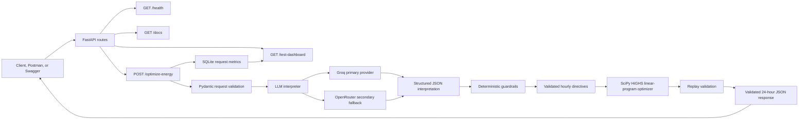

# GridWise Energy Optimizer

FastAPI service for the BUP CSE Fest 2026 GridWise challenge. A language model interprets operator notes into structured directives; deterministic code validates the directives and a SciPy linear program produces the 24-hour schedule.

## Before you begin

You need either Python or Docker. Use the commands for your Operating System.

### Windows PowerShell

Install Python 3.12 or newer from [python.org](https://www.python.org/downloads/) and Docker Desktop from [docs.docker.com/desktop](https://docs.docker.com/desktop/). Then verify the installations:

```powershell
py --version
docker --version
docker compose version
```

### Linux, macOS, or Unix shell

Install Python 3.12 or newer and Docker Engine with the Compose plugin. Follow the official Docker instructions for [Linux](https://docs.docker.com/engine/install/) or [macOS](https://docs.docker.com/desktop/install/mac-install/), then verify:

```bash
python3 --version
docker --version
docker compose version
```

## Local setup

Create and activate a virtual environment, then install the dependencies:

```powershell
py -m venv .venv
.\.venv\Scripts\Activate.ps1
python -m pip install -r requirements-dev.txt
```

If you do not already have a `.env` file, copy the environment template. Set `GROQ_API_KEY` for the primary provider and optionally set `OPENROUTER_API_KEY` for backup failover:

```powershell
if (-not (Test-Path .env)) { Copy-Item .env.example .env }
# Edit .env and set GROQ_API_KEY. Optionally set OPENROUTER_API_KEY.
```

Never commit the key or a `.env` file. Groq is the primary OpenAI-compatible provider. If `GROQ_API_KEY` is unavailable or Groq fails after its retries, the service uses OpenRouter as a secondary provider when `OPENROUTER_API_KEY` is configured. The default backup model is `openai/gpt-oss-20b` (low-cost, not free). The service sends only synthetic operator notes and battery capacity to the model. JSON mode requests valid JSON, and deterministic code validates the directives before optimization. Provider retries, invalid-output retries, and backoff share a 28-second total request budget so the API remains within the judge's 30-second limit.

Start the API from the repository root:

```powershell
python -m uvicorn app.main:app --reload --env-file .env
```

In Git Bash, use your activated virtual environment from the repository root:

```bash
source .venv/Scripts/activate
test -f .env || cp .env.example .env
# Edit .env and set GROQ_API_KEY. Optionally set OPENROUTER_API_KEY.
python -m uvicorn app.main:app --reload --env-file .env
```

Check readiness:

```powershell
curl.exe http://127.0.0.1:8000/health
```

Expected response:

```json
{"status":"ok"}
```

## API routes

The service exposes three useful routes.

FastAPI also exposes interactive API documentation at `http://127.0.0.1:8000/docs`. Open it in a browser, choose `POST /optimize-energy`, select **Try it out**, paste a complete 24-hour request, and select **Execute**. The response appears directly below the request form.

## Public deployment

The current public Render deployment is:

[`https://bup-fest-api-xor.onrender.com`](https://bup-fest-api-xor.onrender.com)

Use these public routes to verify the deployment:

```text
GET  https://bup-fest-api-xor.onrender.com/health
POST https://bup-fest-api-xor.onrender.com/optimize-energy
GET  https://bup-fest-api-xor.onrender.com/test-dashboard
GET  https://bup-fest-api-xor.onrender.com/docs
```

The interactive Swagger/OpenAPI documentation is available at:

[`https://bup-fest-api-xor.onrender.com/docs`](https://bup-fest-api-xor.onrender.com/docs)

Use **Try it out** in Swagger to send a request without installing Postman. The monitoring dashboard is available at:

[`https://bup-fest-api-xor.onrender.com/test-dashboard`](https://bup-fest-api-xor.onrender.com/test-dashboard)

The dashboard shows request count, successful and failed requests, recent status codes, and p95 latency. It stores only request metadata in SQLite; request bodies, headers, and secrets are not stored.

PowerShell health check:

```powershell
Invoke-RestMethod https://bup-fest-api-xor.onrender.com/health
```

Unix shell health check:

```bash
curl -sS https://bup-fest-api-xor.onrender.com/health
```

The free Render service may sleep after inactivity, so the first request can take longer while it starts.

## Architecture flow

The service separates natural-language interpretation from deterministic optimization. The LLM proposes structured directives, but deterministic validation decides whether those directives are safe to apply. The optimizer then produces a schedule and replay validation checks the result before it leaves the API.



### Request lifecycle

1. FastAPI validates the scenario, one to three notes, 24 hourly records, and battery settings.
2. Groq interprets each operator note into one structured directive. If Groq is unavailable, OpenRouter is used as the secondary provider.
3. Deterministic guardrails validate directive types, note indexes, hour windows, numeric values, and adjustment fields.
4. The SciPy HiGHS linear program minimizes grid cost while enforcing solar availability, grid caps, battery charge/discharge limits, reserves, and end-of-day battery neutrality.
5. Replay validation independently checks energy balance, battery bounds, directives, totals, and the final battery level.
6. The API returns the interpretation, 24-hour plan, totals, peak grid usage, and summary. Request metadata is recorded for the dashboard.

### `GET /health`

PowerShell:

```powershell
Invoke-RestMethod http://127.0.0.1:8000/health
```

Unix shell:

```bash
curl -sS http://127.0.0.1:8000/health
```

Expected response:

```json
{"status":"ok"}
```

### `POST /optimize-energy`

This route requires a complete 24-hour JSON request. Save the complete `DASHBOARD-DEMO` request in the Optimization endpoint section below as `request.json`, then use one of these commands.

PowerShell:

```powershell
Invoke-RestMethod `
  -Uri http://127.0.0.1:8000/optimize-energy `
  -Method Post `
  -ContentType 'application/json' `
  -InFile .\request.json
```

Unix shell:

```bash
curl -sS -X POST http://127.0.0.1:8000/optimize-energy \
  -H 'Content-Type: application/json' \
  --data @request.json
```

The response contains the validated directive interpretation, a 24-hour `hourly_plan`, total grid usage, total cost, peak grid usage, and a plan summary.

### `GET /test-dashboard`

This local dashboard displays request count, success/error counts, recent request logs, and p95 latency. It records only timestamp, route, status, and latency in SQLite.

Open it in a browser:

```text
http://127.0.0.1:8000/test-dashboard
```

Or use the custom route test:

```powershell
python -m scripts.custom_test
```

```bash
python3 -m scripts.custom_test
```

## Docker

Docker Compose reads `.env` from the project directory and forwards the Groq primary and OpenRouter backup settings into the container.

Published Docker Hub repository: [alifh23/bup-fest-api](https://hub.docker.com/repository/docker/alifh23/bup-fest-api/general)

Pull the published image with:

```powershell
docker pull alifh23/bup-fest-api:latest
```

Build and run the API with Docker Compose:

```powershell
docker compose up --build -d
```

Check the container status and follow its logs when needed:

```powershell
docker compose ps
docker compose logs -f api
```

The API is then available at `http://127.0.0.1:8000`. If port 8000 is already in use, set `HOST_PORT=8001` in `.env` and use `http://127.0.0.1:8001`. Stop it with:

```powershell
docker compose down
```

Compose reports the API as `healthy` after its `/health` check passes and stores the SQLite metrics in the named `metrics_data` volume. View the local metrics dashboard at `http://127.0.0.1:8000/test-dashboard`.

To build and run the image directly:

```powershell
docker build -t gridwise-api .
docker run --rm -p 8000:8000 --env-file .env gridwise-api
```

The image includes a health check for `GET /health`.

Run the tests:

```powershell
pytest
```

Run one public case against the real Groq model after setting `GROQ_API_KEY`:

```powershell
python -m scripts.smoke_groq
```

This checks the interpreted directives and optimal cost for `SAMPLE-01` without displaying the API key. It makes a real provider request.

Use `python -m scripts.smoke_groq --all` to run all 10 public cases through the live Groq model. This makes 10 provider requests and compares each interpretation and cost with the public reference. The runner waits one second between requests by default; set `GROQ_REQUEST_DELAY_SECONDS` or pass `--delay 2` to increase it. The API logs and retries transient provider errors, HTTP 429 rate-limit responses, timeouts, and invalid model output with exponential backoff; configure `GROQ_MAX_RETRIES`, `GROQ_RETRY_DELAY_SECONDS`, and `GROQ_TOTAL_TIMEOUT_SECONDS`.

### Local latency dashboard

Every real `POST /optimize-energy` request records only its UTC timestamp, route, status code, and latency in SQLite. Request bodies, headers, and secrets are never stored. Open this route after exercising the API:

```powershell
start http://127.0.0.1:8000/test-dashboard
```

The dashboard displays request count, successful requests, errors, recent requests, and the p95 latency calculated from the SQLite log at `METRICS_DB_PATH`.

The local dashboard is available at `http://127.0.0.1:8000/test-dashboard`. The deployed dashboard is available at `https://bup-fest-api-xor.onrender.com/test-dashboard`.

## Testing and verification

Run the deterministic and API test suite locally:

```powershell
pytest -q -s
```

The suite covers request validation, directive guardrails, optimizer constraints, replay validation, provider timeout and retry exhaustion, Groq-to-OpenRouter fallback, dashboard rendering, and secret-safe logging.

Run the live 10-case test against the deployed API and save every complete JSON response:

```powershell
python -m scripts.remote_10_post_test --delay 2
```

The response log is written to `logs/remote_10_post_test.log`. The latest live run passed all 10 public cases. Live latency can vary because Render may start from sleep and external model providers may rate-limit requests.

## Optimization endpoint

`POST /optimize-energy` validates the scenario, requests a structured interpretation from the configured language model, checks every directive against deterministic guardrails, solves the linear program, and independently replays the schedule. A missing key returns 503; an invalid model interpretation returns a controlled 502 response. Do not interpret either as a successful plan.

Example request:

```json
{
  "scenario_id": "TEST-001",
  "operator_notes": ["The cafeteria menu changes tomorrow."],
  "hours": [
    {"hour": 0, "demand_kwh": 10, "solar_kwh": 0, "tariff_bdt_per_kwh": 5}
  ],
  "battery": {
    "capacity_kwh": 50,
    "initial_energy_kwh": 20,
    "minimum_energy_kwh": 5,
    "max_charge_kwh_per_hour": 10,
    "max_discharge_kwh_per_hour": 10
  }
}
```

The real request must contain all 24 hourly entries. The endpoint returns the required 24-hour `hourly_plan`, totals, and directive interpretation. The tests run the public sample cases with mocked model responses; they verify the solver and API integration without making paid API calls. Run a live model smoke test separately before deployment.

Complete 24-hour request and response example (simplified flat tariff, no solar directive):

Request:

```json
{
  "scenario_id": "DASHBOARD-DEMO",
  "operator_notes": ["The cafeteria note has no effect on today's energy plan."],
  "hours": [
    {"hour": 0, "demand_kwh": 10, "solar_kwh": 0, "tariff_bdt_per_kwh": 5},
    {"hour": 1, "demand_kwh": 10, "solar_kwh": 0, "tariff_bdt_per_kwh": 5},
    {"hour": 2, "demand_kwh": 10, "solar_kwh": 0, "tariff_bdt_per_kwh": 5},
    {"hour": 3, "demand_kwh": 10, "solar_kwh": 0, "tariff_bdt_per_kwh": 5},
    {"hour": 4, "demand_kwh": 10, "solar_kwh": 0, "tariff_bdt_per_kwh": 5},
    {"hour": 5, "demand_kwh": 10, "solar_kwh": 0, "tariff_bdt_per_kwh": 5},
    {"hour": 6, "demand_kwh": 10, "solar_kwh": 0, "tariff_bdt_per_kwh": 5},
    {"hour": 7, "demand_kwh": 10, "solar_kwh": 0, "tariff_bdt_per_kwh": 5},
    {"hour": 8, "demand_kwh": 10, "solar_kwh": 0, "tariff_bdt_per_kwh": 5},
    {"hour": 9, "demand_kwh": 10, "solar_kwh": 0, "tariff_bdt_per_kwh": 5},
    {"hour": 10, "demand_kwh": 10, "solar_kwh": 0, "tariff_bdt_per_kwh": 5},
    {"hour": 11, "demand_kwh": 10, "solar_kwh": 0, "tariff_bdt_per_kwh": 5},
    {"hour": 12, "demand_kwh": 10, "solar_kwh": 0, "tariff_bdt_per_kwh": 5},
    {"hour": 13, "demand_kwh": 10, "solar_kwh": 0, "tariff_bdt_per_kwh": 5},
    {"hour": 14, "demand_kwh": 10, "solar_kwh": 0, "tariff_bdt_per_kwh": 5},
    {"hour": 15, "demand_kwh": 10, "solar_kwh": 0, "tariff_bdt_per_kwh": 5},
    {"hour": 16, "demand_kwh": 10, "solar_kwh": 0, "tariff_bdt_per_kwh": 5},
    {"hour": 17, "demand_kwh": 10, "solar_kwh": 0, "tariff_bdt_per_kwh": 5},
    {"hour": 18, "demand_kwh": 10, "solar_kwh": 0, "tariff_bdt_per_kwh": 5},
    {"hour": 19, "demand_kwh": 10, "solar_kwh": 0, "tariff_bdt_per_kwh": 5},
    {"hour": 20, "demand_kwh": 10, "solar_kwh": 0, "tariff_bdt_per_kwh": 5},
    {"hour": 21, "demand_kwh": 10, "solar_kwh": 0, "tariff_bdt_per_kwh": 5},
    {"hour": 22, "demand_kwh": 10, "solar_kwh": 0, "tariff_bdt_per_kwh": 5},
    {"hour": 23, "demand_kwh": 10, "solar_kwh": 0, "tariff_bdt_per_kwh": 5}
  ],
  "battery": {
    "capacity_kwh": 50,
    "initial_energy_kwh": 20,
    "minimum_energy_kwh": 5,
    "max_charge_kwh_per_hour": 10,
    "max_discharge_kwh_per_hour": 10
  }
}
```

Response:

```json
{
  "scenario_id": "DASHBOARD-DEMO",
  "directive_interpretation": [{"note_index": 0, "applies": false, "directive_type": "no_op", "structured_adjustment": null, "explanation": "The note has no effect on today's energy plan."}],
  "hourly_plan": [
    {"hour": 0, "grid_kwh": 10, "solar_used_kwh": 0, "battery_action": "idle", "battery_kwh": 0, "battery_energy_after_kwh": 20},
    {"hour": 1, "grid_kwh": 10, "solar_used_kwh": 0, "battery_action": "idle", "battery_kwh": 0, "battery_energy_after_kwh": 20},
    {"hour": 2, "grid_kwh": 10, "solar_used_kwh": 0, "battery_action": "idle", "battery_kwh": 0, "battery_energy_after_kwh": 20},
    {"hour": 3, "grid_kwh": 10, "solar_used_kwh": 0, "battery_action": "idle", "battery_kwh": 0, "battery_energy_after_kwh": 20},
    {"hour": 4, "grid_kwh": 10, "solar_used_kwh": 0, "battery_action": "idle", "battery_kwh": 0, "battery_energy_after_kwh": 20},
    {"hour": 5, "grid_kwh": 10, "solar_used_kwh": 0, "battery_action": "idle", "battery_kwh": 0, "battery_energy_after_kwh": 20},
    {"hour": 6, "grid_kwh": 10, "solar_used_kwh": 0, "battery_action": "idle", "battery_kwh": 0, "battery_energy_after_kwh": 20},
    {"hour": 7, "grid_kwh": 10, "solar_used_kwh": 0, "battery_action": "idle", "battery_kwh": 0, "battery_energy_after_kwh": 20},
    {"hour": 8, "grid_kwh": 10, "solar_used_kwh": 0, "battery_action": "idle", "battery_kwh": 0, "battery_energy_after_kwh": 20},
    {"hour": 9, "grid_kwh": 10, "solar_used_kwh": 0, "battery_action": "idle", "battery_kwh": 0, "battery_energy_after_kwh": 20},
    {"hour": 10, "grid_kwh": 10, "solar_used_kwh": 0, "battery_action": "idle", "battery_kwh": 0, "battery_energy_after_kwh": 20},
    {"hour": 11, "grid_kwh": 10, "solar_used_kwh": 0, "battery_action": "idle", "battery_kwh": 0, "battery_energy_after_kwh": 20},
    {"hour": 12, "grid_kwh": 10, "solar_used_kwh": 0, "battery_action": "idle", "battery_kwh": 0, "battery_energy_after_kwh": 20},
    {"hour": 13, "grid_kwh": 10, "solar_used_kwh": 0, "battery_action": "idle", "battery_kwh": 0, "battery_energy_after_kwh": 20},
    {"hour": 14, "grid_kwh": 10, "solar_used_kwh": 0, "battery_action": "idle", "battery_kwh": 0, "battery_energy_after_kwh": 20},
    {"hour": 15, "grid_kwh": 10, "solar_used_kwh": 0, "battery_action": "idle", "battery_kwh": 0, "battery_energy_after_kwh": 20},
    {"hour": 16, "grid_kwh": 10, "solar_used_kwh": 0, "battery_action": "idle", "battery_kwh": 0, "battery_energy_after_kwh": 20},
    {"hour": 17, "grid_kwh": 10, "solar_used_kwh": 0, "battery_action": "idle", "battery_kwh": 0, "battery_energy_after_kwh": 20},
    {"hour": 18, "grid_kwh": 10, "solar_used_kwh": 0, "battery_action": "idle", "battery_kwh": 0, "battery_energy_after_kwh": 20},
    {"hour": 19, "grid_kwh": 10, "solar_used_kwh": 0, "battery_action": "idle", "battery_kwh": 0, "battery_energy_after_kwh": 20},
    {"hour": 20, "grid_kwh": 10, "solar_used_kwh": 0, "battery_action": "idle", "battery_kwh": 0, "battery_energy_after_kwh": 20},
    {"hour": 21, "grid_kwh": 10, "solar_used_kwh": 0, "battery_action": "idle", "battery_kwh": 0, "battery_energy_after_kwh": 20},
    {"hour": 22, "grid_kwh": 10, "solar_used_kwh": 0, "battery_action": "idle", "battery_kwh": 0, "battery_energy_after_kwh": 20},
    {"hour": 23, "grid_kwh": 10, "solar_used_kwh": 0, "battery_action": "idle", "battery_kwh": 0, "battery_energy_after_kwh": 20}
  ],
  "total_grid_kwh": 240,
  "total_cost_bdt": 1200,
  "peak_grid_kwh": 10,
  "plan_summary": "Minimizes grid electricity cost while satisfying the validated solar, battery, grid, and neutrality constraints."
}
```
